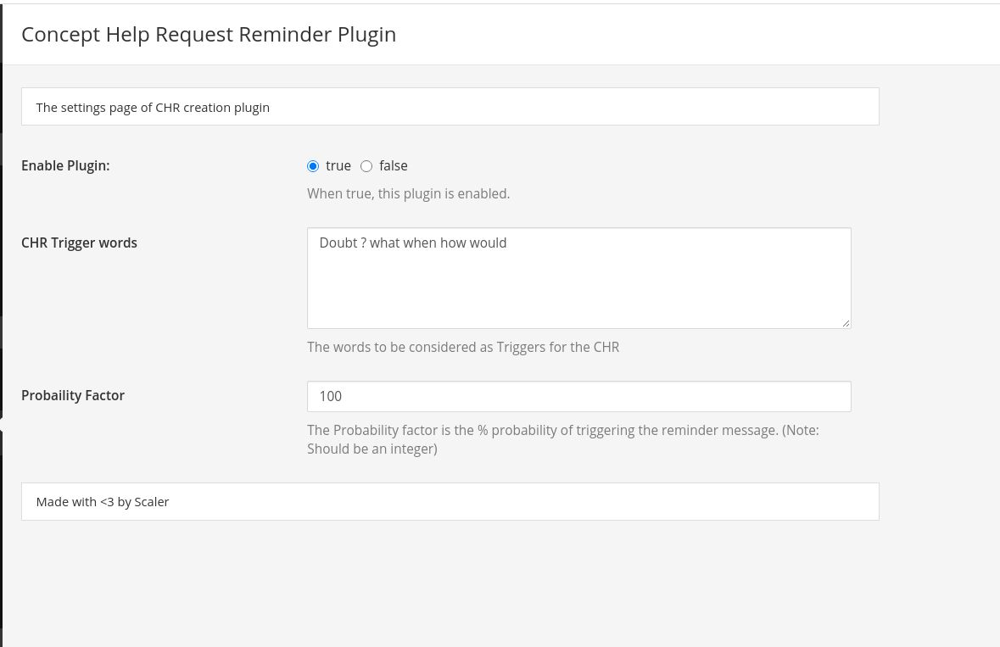
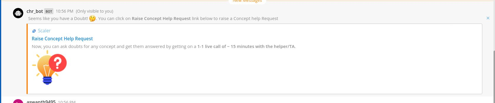

# Mattermost Concept help Request Plugin

This Plugin can be used to remind users about the Concept Help Request feature in Scaler from Mattermost. And provide a direct link to raise a Concept Help Request from the Scaler Academy mentee dashboard.

# How does it work ?
- The settings of Plugin accepts certain trigger words. The admin can fill the required trigger words depending on the probability that it is related to a concept help request. (Eg: Doubt How when CHR Concept Conceptual Topic Help)
- Whenever the user types any of the trigger words in the message if he/she submits it, they'll get a ephemeral message (A message which is only visible to user and goes away after sometime).
- The ephemeral message (Shared in the screenshot section) will ask the mentee if he has any doubt and will have direct link to raise the Concept help Request from the Scaler academy dashboard

# Installation

### Prerequisites (If running the plugin locally)
- Setup Mattermost server. [Click here](https://developers.mattermost.com/contribute/server/developer-setup/)
- Setup Mattermost webapp. [Click here](https://developers.mattermost.com/contribute/webapp/developer-setup/)

After settting up these two. You'll be able to run mattermost locally.

### Installing the Plugin
- Clone the repo
- Set the following environment variables
```
export MM_SERVICESETTINGS_SITEURL=<your_local_mattermost_site_url>
export MM_ADMIN_USERNAME=<username_in_mattermost>
export MM_ADMIN_PASSWORD=<password_in_mattermost>
```
- Run `make deploy` inside the plugin directory

You plugin will be installed and enabled now.

If you want to install the plugin on a different mattermost server.

- Run `make` inside the plugin directory
- You can find `com.mattermost.chr-reminder-plugin-0.1.0.tar.gz` inside the `dist` folder
- Follow these steps after that

Through System Console UI:

- Log in to Mattermost as a System Admin.
- Open the System Console at /admin_console
- Navigate to Plugins (Beta) > Management and upload the plugin.tar.gz you generated above.
- Click Enable under the plugin after it has uploaded.

# Screenshots 
The settings page

Ephemeral message sent when the trigger word is found
